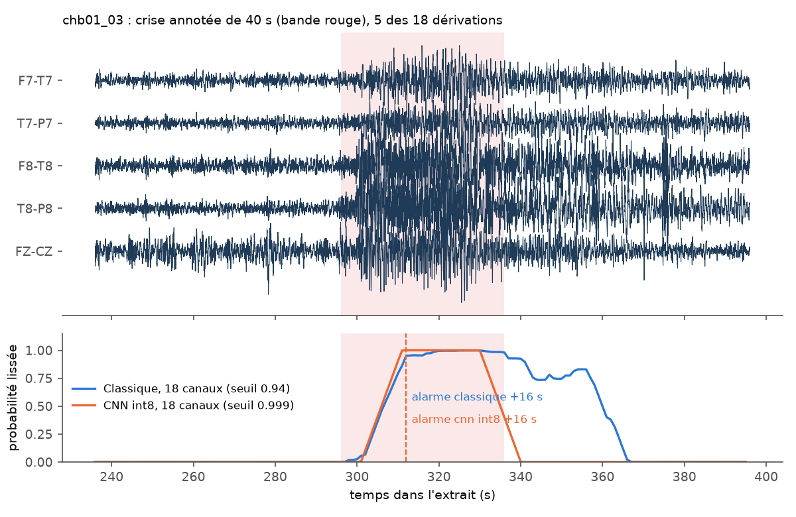
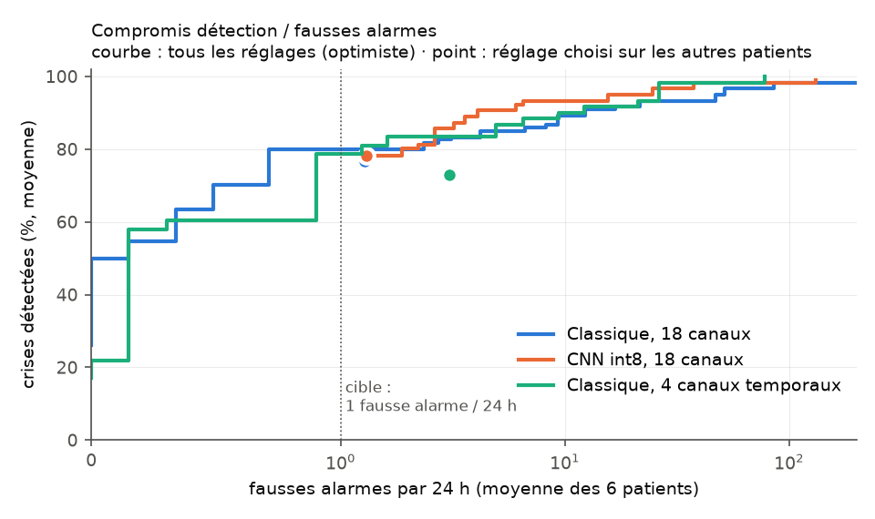

# Détection de crises d'épilepsie sur EEG pour un dispositif portable

Détecter automatiquement une crise d'épilepsie sur l'EEG et **alerter un aidant**
en quelques secondes, avec les contraintes d'un appareil porté : décision en
temps réel sans regarder le futur, modèle de quelques dizaines de Ko, et surtout
**très peu de fausses alarmes** (sinon la famille éteint l'appareil).

Quatrième volet d'un portfolio en IA appliquée à la santé, après
[stroke-risk-predictor](https://github.com/alixe09/stroke-risk-predictor) (données tabulaires),
[radio-thoracique](https://github.com/alixe09/radio-thoracique) (images, CNN, Grad-CAM) et
[emg-prothese](https://github.com/alixe09/emg-prothese) (EMG, CNN int8 embarqué, dossier
« dispositif médical ») : ici, **détection d'événements rares** dans un signal continu,
avec la même démarche (pipeline complet, évaluation honnête, métriques orientées patient,
démo Streamlit, dossier dispositif médical).

⚠️ **Disclaimer** : projet pédagogique / recherche de stage. Ce n'est **pas** un
dispositif médical.



## En bref

- **166 h d'EEG, 6 enfants, 50 crises** (CHB-MIT). Chaque heure est testée par un modèle
  qui ne l'a jamais vue, et le réglage d'alarme de chaque patient est choisi **sur les
  5 autres**.
- **35 crises sur 50 détectées, 1,0 fausse alarme par 24 h, délai médian 13–16 s**, aussi
  bien pour la méthode classique que pour le réseau de neurones.
- **Le CNN tient dans 29 Ko en int8**, sans aucune perte clinique par rapport au float.
- **Échec assumé** : les 10 crises de chb16, très brèves (6–14 s), ne sont jamais détectées.
- **Le dossier dispositif médical a trouvé 3 défauts**, corrigés avant les résultats
  finaux, et 2 risques qui restent ouverts.

## Dataset

[CHB-MIT Scalp EEG Database](https://physionet.org/content/chbmit/1.0.0/) (PhysioNet,
licence ODC-By 1.0) : EEG de scalp d'enfants épileptiques hospitalisés à Boston, 23
dérivations à 256 Hz, crises annotées par des neurologues.

> Shoeb, A. H. (2009). *Application of machine learning to epileptic seizure onset
> detection and treatment.* PhD Thesis, MIT.
> Goldberger, A. et al. (2000). PhysioBank, PhysioToolkit, and PhysioNet. *Circulation*
> 101(23), e215–e220.

**Sous-ensemble** (contrainte : ~9 Go de disque libre, 6 Go de RAM, pas de GPU) :
6 patients choisis pour leur faible volume et leur nombre de crises.

| Patient | Sexe, âge | Durée | Crises | Durée des crises |
|---|---|---|---|---|
| chb01 | F, 11 ans | 40,6 h | 7 | 27–101 s |
| chb05 | F, 7 ans | 39,0 h | 5 | 96–120 s |
| chb08 | M, 3,5 ans | 20,0 h | 5 | 134–264 s |
| chb16 | F, 7 ans | 19,0 h | 10 | **6–14 s** |
| chb23 | F, 6 ans | 26,6 h | 7 | 20–113 s |
| chb24 | non renseigné | 21,3 h | 16 | 16–70 s |

**Stockage compact** ([`src/telecharger_chbmit.py`](src/telecharger_chbmit.py)) : chaque
EDF (42 Mo) est téléchargé, réduit aux 18 dérivations bipolaires communes,
rééchantillonné à 128 Hz, stocké en int16 compressé, puis supprimé. 7,2 Go d'EDF
deviennent **2,0 Go**. Lecteur EDF écrit en numpy ([`src/edf.py`](src/edf.py), vérifié
identique à MNE à 1e-13 µV près) pour éviter une dépendance lourde.

## Méthode

**Prétraitement commun, causal** ([`src/pretraitement.py`](src/pretraitement.py)) :
passe-bande 0,5–40 Hz (Butterworth, filtrage avant uniquement), fenêtres de 4 s,
**une décision par seconde**.

| | Méthode classique | Réseau de neurones |
|---|---|---|
| Entrée | 8 caractéristiques × 18 dérivations : énergie dans 5 bandes (δ θ α β γ), longueur de ligne, paramètres de Hjorth | EEG filtré brut, 4 s × 18 dérivations, normalisé par canal |
| Modèle | Gradient boosting (scikit-learn), classes pondérées | CNN 1D, 4 convolutions, 16 000 paramètres, exporté en **int8** |
| Déséquilibre (crises = 0,3 % du temps) | Pondération des classes | Lots tirés à moitié dans les crises, avec décalage temporel aléatoire |

**Évaluation** ([`src/decoupage.py`](src/decoupage.py), [`src/evaluation.py`](src/evaluation.py)) :

- **Par patient**, validation croisée à 4 plis **par enregistrement d'1 h** : aucune
  fenêtre de test ne chevauche l'entraînement, chaque pli contient au moins une crise,
  chaque heure est testée une fois.
- **Des probabilités aux alarmes** : moyenne des *n* dernières décisions, alarme au
  franchissement du seuil, puis 60 s sans nouvelle alarme.
- **Réglage d'usine** : le seuil et *n* d'un patient sont choisis sur les 5 autres, avec
  une règle fixée à l'avance : maximiser la sensibilité sous la contrainte de ≤ 1 fausse
  alarme par 24 h en moyenne.
- **Métriques par événement**, tolérances du cadre SzCORE (Dan et al., *Epilepsia*
  2024) : une crise est détectée si une alarme tombe entre 30 s avant son début et 60 s
  après sa fin ; toute autre alarme est fausse.

## Résultats

| Patient | Classique : crises | FA / 24 h | Délai méd. | CNN int8 : crises | FA / 24 h | Délai méd. |
|---|---|---|---|---|---|---|
| chb01 | 6 / 7 | 0,0 | 15 s | **7 / 7** | 0,0 | 13 s |
| chb05 | 5 / 5 | 0,0 | 17 s | 5 / 5 | 0,0 | 16 s |
| chb08 | 5 / 5 | **0,0** | 14 s | 5 / 5 | 2,4 | 23 s |
| chb16 | 0 / 10 | 0,0 | — | 0 / 10 | 0,0 | — |
| chb23 | 7 / 7 | 0,9 | 24 s | 7 / 7 | 0,9 | 14 s |
| chb24 | **12 / 16** | 6,8 | 7 s | 11 / 16 | **4,5** | 16 s |
| **Total, 166 h** | **35 / 50** | **1,0** | **13 s** | **35 / 50** | **1,0** | **16 s** |



Lecture :

- **Les deux méthodes font jeu égal** au total, avec des profils différents : le CNN ne
  manque aucune crise chez chb01 et fait moins de fausses alarmes chez chb24 ; la méthode
  classique n'en fait aucune chez chb08. Avec 50 crises, aucune différence n'est
  statistiquement établie. À performance égale, la méthode classique est plus facile à
  expliquer à un clinicien.
- **4 patients sur 6 sont proches d'un usage réel** (toutes ou presque toutes les crises,
  ≤ 1 fausse alarme par jour). **chb24 en reste loin** : 5 à 7 fausses alarmes par jour
  sont trop pour une famille.
- **chb16 est entièrement manqué, et c'est instructif** : ses crises durent 6 à 14 s. Le
  réglage choisi sur les autres patients (moyenne sur 10 s, seuil haut) empêche une crise
  aussi brève de franchir le seuil. Le modèle, lui, les voit souvent (méthode classique :
  probabilité ≥ 0,87 sur au moins une fenêtre pendant 6 crises sur 10). Un réglage individuel en récupère 3 sur 10 sans fausse
  alarme : la durée typique des crises d'un patient est un paramètre de calibration.
- **Délai médian de 13–16 s** : l'alarme arrive pendant la crise, pas avant ; ce
  système détecte, il ne prédit pas.
- **Montage réduit « portable »** (4 dérivations temporales, proches d'électrodes autour
  de l'oreille, méthode classique) : 36 / 50 crises mais 2,3 fausses alarmes par 24 h
  (point vert sous la courbe). Réduire le nombre d'électrodes coûte surtout en fausses
  alarmes.

Détails par patient et courbes complètes : `resultats/resume_*.json`, régénérés par
`python src/resumer.py classique cnn cnn_int8 classique_temporaux`.

### Embarqué

| | Classique | CNN int8 |
|---|---|---|
| Taille du modèle | 66 arbres, ~1 900 nœuds | **29 Ko** (TensorFlow Lite int8, poids et activations) |
| Calcul par décision (1 / s) | 18 FFT de 512 points + parcours des arbres | **1,4 M multiplications-accumulations** |
| Temps de calcul sur PC | 0,6 ms (caractéristiques) | 0,23 ms |
| Perte due à l'int8 | — | aucune : 35 / 50 et 1,0 FA / 24 h, décisions identiques à ≥ 99,8 % |

1,4 M opérations par seconde, c'est une petite fraction de ce que calcule un
microcontrôleur Cortex-M4 ; la latence sur cible n'a pas été mesurée (pas de carte).
Pièges rencontrés et corrigés ([`src/export_tflite.py`](src/export_tflite.py)) : la
sigmoïde quantifiée plafonnait à 0,996 alors que le seuil utile est 0,999 (on quantifie
désormais le logit) ; la calibration de la quantification ne voyait que des fenêtres de
crise, et toutes les probabilités basses tombaient à 0,5.

### Limites

- 6 patients, 50 crises : les intervalles de confiance sont larges. Un seul
  entraînement par configuration.
- EEG **hospitalier** de 18 dérivations, patients alités, souvent en sevrage de
  traitement : un appareil porté aurait moins d'électrodes et beaucoup plus d'artefacts
  de mouvement. Un artefact simulé de 800 µV à 1,5 Hz est pris pour une crise par les
  deux méthodes ([`src/robustesse.py`](src/robustesse.py)).
- Modèles spécifiques au patient : il faut avoir enregistré des crises pour calibrer.
  Le cas « nouveau patient sans calibration » n'est pas évalué.
- La grille de seuils s'arrête à 0,999 et c'est la valeur retenue pour le CNN : un seuil
  plus haut pourrait mieux faire.
- Plis non chronologiques (un modèle peut s'entraîner sur des heures postérieures au
  test), comme la plupart des travaux sur CHB-MIT.

## Dossier « dispositif médical » et tests

Exercice appliquant la démarche d'un fabricant, dans
[`docs/dispositif-medical/`](docs/dispositif-medical/README.md) : usage prévu et statut
réglementaire (MDR, IEC 62304), 7 exigences fixées **avant** les résultats, **analyse des
risques** inspirée d'ISO 14971 et **matrice de traçabilité** générée automatiquement.

La démarche a trouvé **trois défauts, corrigés avant les résultats finaux** :

1. **Un modèle sur quatre prédisait « crise » en permanence** (360 fausses alarmes par
   jour chez chb01), à cause de la BatchNormalization, dont les statistiques étaient
   apprises sur des lots équilibrés 50/50, très loin du flux réel. Architecture corrigée
   et contrôle automatique après chaque entraînement.
2. **Deux erreurs de quantification int8** (ci-dessus).
3. **Un seuil de saturation qui aurait bloqué de vraies crises** : fixé d'abord à
   1 500 µV, il a été relevé à 3 000 µV après avoir mesuré des crises montant à
   2 400 µV. Le contrôle de qualité du signal ([`src/qualite_signal.py`](src/qualite_signal.py))
   bloque l'appareil débranché et les dérivations saturées, touche 0,016 % des fenêtres
   réelles au plus et aucune fenêtre de crise.

```bash
python -m pytest tests            # 20 tests : signal, métriques cliniques, sécurité, modèle int8
python src/verification_report.py # relance les tests et régénère la matrice de traçabilité
```

## Démo

Application Streamlit qui rejoue 4 extraits d'enregistrements comme le ferait
l'appareil : l'EEG défile, la probabilité de crise monte, l'alarme se déclenche (ou
pas). Les probabilités viennent des modèles qui n'ont **jamais vu** l'enregistrement,
avec le réglage d'usine de chaque patient ; on peut aussi modifier le réglage pour voir
le compromis détection / fausses alarmes. Le cas chb16 (crises de 6 et 8 s) montre
l'échec.

```bash
streamlit run app/streamlit_app.py
```

## Reproduire

Python 3.12, dépendances dans `requirements.txt` (~45 min de calcul sur un portable
sans GPU, hors téléchargement).

```bash
python src/telecharger_chbmit.py          # ~7 Go téléchargés, 2 Go conservés
python src/caracteristiques.py            # cache des caractéristiques
python src/classique.py
python src/classique.py --canaux temporaux
python src/cnn.py                         # 23 modèles (un par patient et par pli)
python src/export_tflite.py               # int8 + probabilités int8
python src/resumer.py classique classique_temporaux cnn cnn_int8
python src/robustesse.py
python src/embarque.py
python src/make_demo_data.py
python src/figures.py
python src/verification_report.py
```

## Structure

```
src/
  telecharger_chbmit.py  edf.py  donnees.py     données
  pretraitement.py  qualite_signal.py            filtrage causal, fenêtres, contrôle de qualité
  caracteristiques.py  classique.py              méthode classique
  cnn.py  export_tflite.py  embarque.py          réseau de neurones, int8, budget embarqué
  decoupage.py  evaluation.py  resumer.py        validation croisée, alarmes, métriques cliniques
  robustesse.py  verification_report.py          analyse des risques, traçabilité
  make_demo_data.py  figures.py
tests/                                           20 tests pytest
app/                                             démo Streamlit (4 extraits, 8 Mo)
resultats/                                       résumés JSON, modèles int8 (.tflite)
docs/                                            figures, dossier dispositif médical
```
